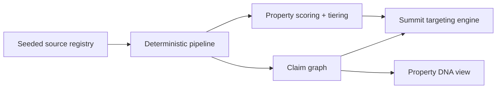

# Architecting an Autonomous Market Intelligence System

This repository is a deliberately scoped demo of the larger roadmap in `Technical solution - AI solution analyst.docx`.

It does not try to build the entire production pipeline. It builds the first recruiter-friendly slice that proves the thinking:

- a governed source registry that separates allowed, restricted, and validation-only data sources
- a deterministic scoring engine for Newark and Jersey City properties
- a provenance-aware claim graph for ownership, officers, lenders, and projects
- a summit targeting view that ranks who matters based on property control, civic influence, and prior event overlap

## Why this repo exists

The original document is a 6-phase technical architecture for a real estate market intelligence system. A recruiter does not need the full production build to understand the quality of the architecture. They need a clean demo that shows:

1. the ontology is structured
2. the legal and source-governance concerns were taken seriously
3. the scoring logic is deterministic where it should be
4. the product can turn parcel intelligence into a ranked contact list

That is what this repo ships.

## What the demo includes

- `app/demo_data.py`
  Seeded Newark and Jersey City data for parcels, organizations, people, projects, source documents, and claims.
- `app/pipeline.py`
  Deterministic classification, priority scoring, claim generation, and summit target ranking.
- `app/main.py`
  FastAPI app exposing a lightweight dashboard and JSON endpoints.
- `schema/postgres.sql`
  Production-oriented Postgres/PostGIS schema for the real system.
- `.github/workflows/ci.yml`
  CI that runs unit tests and compiles the Python source.

## Demo architecture



## Local run

```bash
python3 -m venv .venv
source .venv/bin/activate
pip install -r requirements.txt
uvicorn app.main:app --reload
```

Then open `http://127.0.0.1:8000`.

## API endpoints

- `GET /api/demo`
- `GET /api/properties`
- `GET /api/properties/{property_id}`
- `GET /api/targets`
- `GET /api/sources`
- `GET /healthz`

## What the recruiter should notice

- The source registry makes it explicit that Google Places is validation-only and LoopNet / LinkedIn are not scraped.
- Property class codes drive the first classification pass instead of letting an LLM guess obvious facts.
- Priority scoring is transparent and broken into assessed value, class relevance, permit activity, corridor importance, transit proximity, and network overlap.
- Every ownership or financing relationship is backed by a source document and confidence tier.
- The targeting layer connects properties to humans, which is the actual business outcome for summits.

## Production path after this demo

The production roadmap still follows the original document:

- move seeded data into Postgres 16 + PostGIS
- replace seed adapters with NJGIN, Overture, recorder, and registry adapters
- add Celery for async enrichment tasks
- add LangGraph for ownership-chain investigation and messy document workflows
- add a real frontend and vector tiles once live spatial data is flowing

## Intentional shortcuts in this repo

- The dataset is seeded instead of downloaded live.
- The UI is dependency-light and served directly from FastAPI.
- There is no Celery worker, Redis, or LangGraph runtime in the demo.
- The schema file is production-facing, while the running demo uses in-memory compiled state for portability.

That tradeoff is intentional. The goal of this repository is to be easy to run, easy to review, and strong enough to demonstrate systems thinking quickly.
